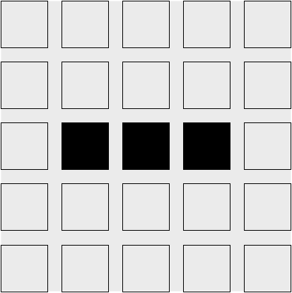

# 康威生命游戏规则

*注：如果你已经熟悉康威的生活游戏及其规则，请跳到下一节！*

[查看维基百科对康威生命游戏规则的描述：](https://zh.wikipedia.org/wiki/康威生命游戏)

> 生命游戏中，对于任意细胞，规则如下：
> 1. 每个细胞有两种状态-存活或死亡，每个细胞与以自身为中心的周围**八格**细胞产生互动（如图，黑色为存活，白色为死亡）
> 2. 当前细胞为存活状态时，当周围的存活细胞低于2个时（不包含2个），该细胞变成死亡状态。（模拟生命数量稀少）
> 3. 当前细胞为存活状态时，当周围有2个或3个存活细胞时，该细胞保持原样。
> 4. 当前细胞为存活状态时，当周围有超过3个存活细胞时，该细胞变成死亡状态。（模拟生命数量过多）
> 5. 当前细胞为死亡状态时，当周围有3个存活细胞时，该细胞变成存活状态。（模拟繁殖）
>
> 可以把最初的细胞结构定义为种子，当所有在种子中的细胞**同时**被以上规则处理后，可以得到第一代细胞图。按规则继续处理当前的细胞图，可以得到下一代的细胞图，周而复始。

考虑以下为初始宇宙：

我们可以通过考虑每个细胞来计算下一代。左上角的牢房死了。规则（4）是唯一适用于死细胞的转换规则。但是，因为左上角的单元格没有正好三个活动的邻居，所以转换规则不适用，并且在下一代中它仍然是死的。第一行的其他单元格也是如此。

当我们考虑最上面的活细胞时，事情变得有趣了，在第二行，第三列。对于活细胞，前三条规则中的任何一条都可能适用。在这个细胞的情况下，它只有一个活的邻居，因此规则（1）适用：这个细胞将在下一代死亡。同样的命运等待着底部的活细胞。

中间的活细胞有两个活的邻居：顶部和底部的活细胞。这意味着规则（2）适用，并且在下一代仍然存在。

最后一个有趣的例子是中间活细胞左右两侧的死细胞。三个活细胞都是这两个细胞的邻居，这意味着规则（4）适用，这些细胞将在下一代变得有活力。

把它们放在一起，我们在下一个滴答声之后得到这个宇宙：

从这些简单而确定的规则中，奇怪而令人兴奋的行为出现了：

#### `戈斯珀滑翔机枪`

#### 脉冲星

#### 太空船

## 视频

[Youtube](https://www.youtube.com/watch?v=C2vgICfQawE)
[Bilibili](https://www.bilibili.com/video/BV1jJ411J7PM?from=search&seid=7436452962981491560)

## 练习

- 手工计算我们示例宇宙的下一个滴答声。注意到熟悉的东西了吗？

### 答案
它应该是示例宇宙的初始状态：

这种模式是周期性的：每两次滴答声之后，它就会返回到初始状态。

- 你能找到一个稳定的初始宇宙吗？也就是说，宇宙中每一代人都是一样的。

### 答案
有无数稳定的宇宙！平凡稳定的宇宙就是空的宇宙。一个二乘二平方的活细胞也是一个稳定的宇宙。