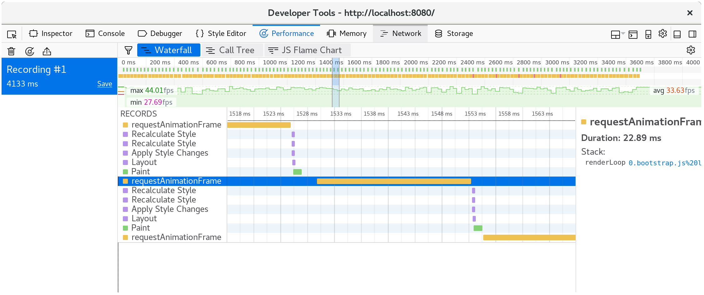
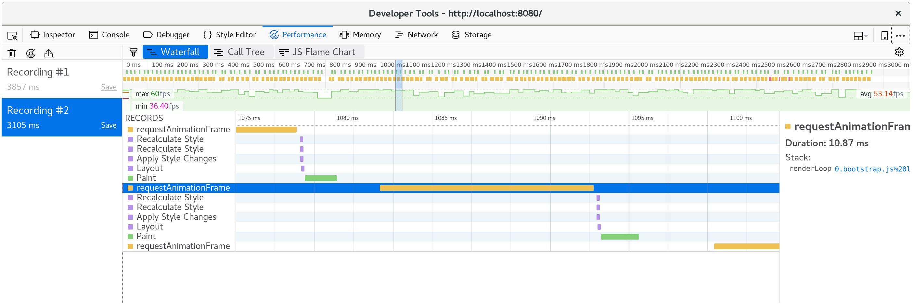
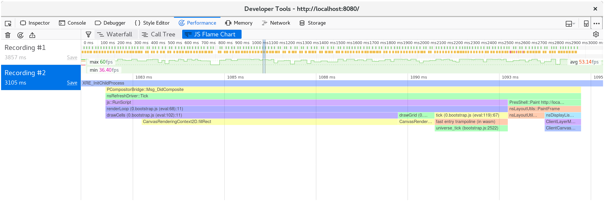

# 时间分析

在本章中，我们将改进游戏实现的性能并利用时间分析来辅助我们的工作。


## 使用 `window.performance.now` 函数创建每秒帧数计时器

当我们研究如何加速游戏渲染时，这个 FPS 计时器将非常有用。

我们首先添加一个 `fps` 对象到 `wasm-game-of-life/www/index.js`：

```javascript
const fps = new class {
  constructor() {
    this.fps = document.getElementById('fps');
    this.frames = [];
    this.lastFrameTimeStamp = performance.now();
  }

  render() {
    // Convert the delta time since the last frame render into a measure
    // of frames per second.
    const now = performance.now();
    const delta = now - this.lastFrameTimeStamp;
    this.lastFrameTimeStamp = now;
    const fps = (1 / delta) * 1000;

    // Save only the latest 100 timings.
    this.frames.push(fps);
    if (this.frames.length > 100) {
      this.frames.shift();
    }

    // Find the max, min, and mean of our 100 latest timings.
    let min = Infinity;
    let max = -Infinity;
    let sum = 0;
    for (let i = 0; i < this.frames.length; i++) {
      sum += this.frames[i];
      min = Math.min(this.frames[i], min);
      max = Math.max(this.frames[i], max);
    }
    let mean = sum / this.frames.length;

    // Render the statistics.
    this.fps.textContent = `
Frames per Second:
         latest = ${Math.round(fps)}
avg of last 100 = ${Math.round(mean)}
min of last 100 = ${Math.round(min)}
max of last 100 = ${Math.round(max)}
`.trim();
  }
}();
```

接着，在每次 `renderLoop` 迭代时，我们调用 `fps.render` 函数：

```javascript
const renderLoop = () => {
  fps.render(); // 新

  universe.tick();
  drawGrid();
  drawCells();

  animationId = requestAnimationFrame(renderLoop);
};
```

最后，别忘了添加 `fps` 元素到 `wasm-game-of-life/www/index.html`，就在 `<canvas>` 上面：

```html
<div id="fps"></div>
```

并添加CSS以使其格式更美观：
```css
#fps {
    white-space: pre;
    font-family: monospace;
}
```

瞧！刷新 [http://localhost:8080](http://localhost:8080)，现在我们有一个 FPS 计数器！

### 用 `console.time` 和 `console.timeEnd` 计时每个 `Universe::tick`

需要测量每次 `Universe::tick` 调用的时间，我们可以使用 `console.time` 和 `console.timeEnd`，通过 `web-sys` crate。

首先，在 `wasm-game-of-life/Cargo.toml` 添加 `web-sys` 作为依赖：

```toml
[dependencies.web-sys]
version = "0.3"
features = [
    "console",
]
```

因为每个 `console.time` 调用都应该有一个对应的 `console.timeEnd` 调用，方便将它们包装为一个 [`RAII类型`](https://zh.wikipedia.org/wiki/RAII) ：

```rust
extern crate web_sys;
use web_sys::console;

pub struct Timer<'a> {
    name: &'a str,
}

impl<'a> Timer<'a> {
    pub fn new(name: &'a str) -> Timer<'a> {
        console::time_with_label(name);
        Timer { name }
    }
}

impl<'a> Drop for Timer<'a> {
    fn drop(&mut self) {
        console::time_end_with_label(self.name);
    }
}
```

然后，我们可以通过将以下代码段添加到方法的顶部来计算每个 `Universe::tick` 需要多长时间：

```rust
let _timer = Timer::new("Universe::tick");
```

每次调用 `Universe::tick` 所用的时间现在都记录在控制台中：


此外，`console.time` 和 `console.timeEnd` 对将显示在浏览器探查器的“时间线”或“瀑布”视图中：


## 扩大我们的游戏世界

> ⚠️ 本节使用Firefox的示例屏幕截图。虽然所有现代浏览器都有类似的工具，但使用不同的开发人员工具可能会有细微差别。
> 您提取的概要信息在本质上是相同的，但是您的里程数可能因您看到的视图和不同工具的命名而有所不同。

如果我们游戏宇宙变得更大会发生什么？
将 64x64 的宇宙替换为 128x128 的宇宙（通过修改 `wasm-game-of-life/src/lib.rs` 中的 `Universe::new`）会导致在我的机器上FPS从平滑的 60 下降到起伏的 40。

如果我们记录一个配置文件（profile）并查看瀑布视图，我们会看到每个动画帧花费超过 20 毫秒。回想一下，每秒 60 帧的意思是，渲染帧的整个过程最多 16 毫秒。其中不仅仅是我们的 JavaScript 和 WebAssembly，还有浏览器正在做的其他事情，比如绘画。



如果我们看一下单个动画帧中发生的情况，就会发现 `CanvasRenderingContext2D.fillStyle` setter 运行开销非常昂贵！

> 在Firefox中，如果您看到一行仅仅显示“DOM”而不是上面提到的 `CanvasRenderingContext2D.fillStyle`，您可能需要在 `performance developer tools` 选项中打开“Show Gecko Platform Data”选项：
>
> 


我们可以通过查看调用树的多帧聚合来确认这不是异常：


我们将近 40％ 的时间花在了这个 setter 上！

> ⚡ 我们可能会想这个 `tick` 方法是性能瓶颈，但事实并非如此。
> 要让分析引导您的注意力，不然时间可能花在您不期望的地方。

`wasm-game-of-life/www/index.js` 的 `drawCells` 函数里面，对每次动画帧，Universe 中的每个单元格都设置一次 `fillStyle` 属性：

```javascript
for (let row = 0; row < height; row++) {
  for (let col = 0; col < width; col++) {
    const idx = getIndex(row, col);

    ctx.fillStyle = cells[idx] === DEAD ? DEAD_COLOR : ALIVE_COLOR;

    ctx.fillRect(
      col * (CELL_SIZE + 1) + 1,
      row * (CELL_SIZE + 1) + 1,
      CELL_SIZE,
      CELL_SIZE
    );
  }
}
```

现在我们已经发现了这个 `fillStyle` 是如此昂贵，我们可以做些什么来避免经常设置它？
我们需要改变 `fillStyle`，表明单元格是活着还是死亡。
如果我们设定 `fillStyle = ALIVE_COLOR` ，然后在一次通过，绘制完所有活单元格，然后设置 `fillStyle = DEAD_COLOR`，并在另一次，绘制所有死单元格，然后到结束，我们只设置了 `fillStyle` 两次，而不是单元格数。

```javascript
// 活细胞
ctx.fillStyle = ALIVE_COLOR;
for (let row = 0; row < height; row++) {
  for (let col = 0; col < width; col++) {
    const idx = getIndex(row, col);
    if (cells[idx] !== Cell.Alive) {
      continue;
    }

    ctx.fillRect(
      col * (CELL_SIZE + 1) + 1,
      row * (CELL_SIZE + 1) + 1,
      CELL_SIZE,
      CELL_SIZE
    );
  }
}

// 死细胞
ctx.fillStyle = DEAD_COLOR;
for (let row = 0; row < height; row++) {
  for (let col = 0; col < width; col++) {
    const idx = getIndex(row, col);
    if (cells[idx] !== Cell.Dead) {
      continue;
    }

    ctx.fillRect(
      col * (CELL_SIZE + 1) + 1,
      row * (CELL_SIZE + 1) + 1,
      CELL_SIZE,
      CELL_SIZE
    );
  }
}
```

保存这些更改，并刷新 [http://localhost:8080/](http://localhost:8080/) 后，渲染恢复到每秒平滑 60 帧。

如果我们采用另一个配置文件，我们可以看到现在每个动画帧只花费大约 10 毫秒。



击败罪魁祸首，我们看到了 `fillStyle` 成本已经消失，我们的大部分时间花在了内部的fillRect，其是绘制每个单元格的矩形。



## 运动得更快

有些人不喜欢等待，他们更喜欢的是，如果不是每个动画帧发生一次宇宙的 `tick`，而是九次 `tick`。

```javascript
for (let i = 0; i < 9; i++) {
  universe.tick();
}
```

这使我的机器上回到每秒只有 35 帧。不行。我们要黄油般流畅的 60帧！

现在我们知道时间花在了 `Universe::tick`，所以让我们添加一些 `Timer`，用 `console.time` 和 `console.timeEnd` 调用来包装它的各个部分，然后，看看它引导我们的地方。
我假设啊，是分配一个新的单元格向量（vector），后在每次 `tick`，就要释放旧向量是昂贵的，占用了我们时间预算的很大一部分。

```rust
pub fn tick(&mut self) {
    let _timer = Timer::new("Universe::tick");

    let mut next = {
        let _timer = Timer::new("allocate next cells");
        self.cells.clone()
    };

    {
        let _timer = Timer::new("new generation");
        for row in 0..self.height {
            for col in 0..self.width {
                let idx = self.get_index(row, col);
                let cell = self.cells[idx];
                let live_neighbors = self.live_neighbor_count(row, col);

                let next_cell = match (cell, live_neighbors) {
                    // 规则 1: 任何少于两个邻居的活细胞死亡，就好像是由于人口不足造成的一样。.
                    (Cell::Alive, x) if x < 2 => Cell::Dead,
                    // 规则 2: 任何一个有两个或三个邻居的活体细胞都能传到下一代。.
                    (Cell::Alive, 2) | (Cell::Alive, 3) => Cell::Alive,
                    // 规则 3: 任何居住着三个以上邻居的活细胞都会死亡，就好像是由于人口过剩。.
                    (Cell::Alive, x) if x > 3 => Cell::Dead,
                    // 规则 4:任何一个只有三个相邻的活细胞的死细胞都会变成活细胞，就像通过繁殖一样。.
                    (Cell::Dead, 3) => Cell::Alive,
                    // 所有其他单元格保持相同状态。
                    (otherwise, _) => otherwise,
                };

                next[idx] = next_cell;
            }
        }
    }

    let _timer = Timer::new("free old cells");
    self.cells = next;
}
```

看看时间，很明显我的假设是不正确的：绝大部分时间，实际花在计算下一代单元格上。
令人惊讶的是，在每次 `tick` 上分配和释放向量，似乎具有可忽略的成本。
分析记录是始终指导我们工作的提醒！


下一节需要 `nightly` 编译器。它是必需的，因为 [测试 feature（特性）](https://doc.rust-lang.org/unstable-book/library-features/test.html#test) 我们准备用于基准测试。我们将安装的另一个工具是 [Cargo benchcmp](https://github.com/BurntSushi/cargo-benchcmp) 。
它是一个小实用程序，用于比较 `cargo bench` 生成的微基准测试。

一个 `#[bench]` 原生代码，就做了我们 WebAssembly 正在做的事情，但我们可以使用更成熟的分析工具。
这是新的 `wasm-game-of-life/benches/bench.rs`：

```rust
#![feature(test)]

extern crate test;
extern crate wasm_game_of_life;

#[bench]
fn universe_ticks(b: &mut test::Bencher) {
    let mut universe = wasm_game_of_life::Universe::new();

    b.iter(|| {
        universe.tick();
    });
}
```

我们还要注释所有的 `#[wasm_bindgen]` 标示，和来自 `Cargo.toml` 的 `"cdylib"`，不然，构建本机代码将失败并出现链接错误。

有了这一切，我们就可以运行了 `cargo bench | tee before.txt` 编译并运行我们的基准测试！`| tee before.txt` 部分将从 `cargo bench` 中获取输出，并放入一个名为 `before.txt` 的文件。

```bash
$ cargo bench | tee before.txt
    Finished release [optimized + debuginfo] target(s) in 0.0 secs
     Running target/release/deps/wasm_game_of_life-91574dfbe2b5a124

running 0 tests

test result: ok. 0 passed; 0 failed; 0 ignored; 0 measured; 0 filtered out

     Running target/release/deps/bench-8474091a05cfa2d9

running 1 test
test universe_ticks ... bench:     664,421 ns/iter (+/- 51,926)

test result: ok. 0 passed; 0 failed; 0 ignored; 1 measured; 0 filtered out
```

这也告诉我们二进制文件的位置，我们可以再次运行基准测试，但这次是在我们的操作系统的分析器下。
就我而言，我正在运行 Linux，所以 `perf` 是我将使用的探查分析器：

```bash
$ perf record -g target/release/deps/bench-8474091a05cfa2d9 --bench
running 1 test
test universe_ticks ... bench:     635,061 ns/iter (+/- 38,764)

test result: ok. 0 passed; 0 failed; 0 ignored; 1 measured; 0 filtered out

[ perf record: Woken up 1 times to write data ]
[ perf record: Captured and wrote 0.178 MB perf.data (2349 samples) ]
```

用 `perf report` 加载配置文件，表明我们所有的时间都花在了 `Universe::tick`，如预期的那样：


如果你按 `a`，工具 `perf` 将注释一个函数时间中的哪些命令的花费：


这告诉我们 26.67％的时间用于求和相邻单元格的值，23.41％的时间用于获取邻居的列索引，另外 15.42％的时间用于获取邻居的行索引。
在这三大最昂贵的命令中，第二和第三命令都让 `div` 很昂贵。这些 `div` 在 `Universe::live_neighbor_count` 实现 modulo 索引逻辑。

回想一下 `wasm-game-of-life/src/lib.rs` 里面的 `live_neighbor_count` 定义：

```rust
fn live_neighbor_count(&self, row: u32, column: u32) -> u8 {
    let mut count = 0;
    for delta_row in [self.height - 1, 0, 1].iter().cloned() {
        for delta_col in [self.width - 1, 0, 1].iter().cloned() {
            if delta_row == 0 && delta_col == 0 {
                continue;
            }

            let neighbor_row = (row + delta_row) % self.height;
            let neighbor_col = (column + delta_col) % self.width;
            let idx = self.get_index(neighbor_row, neighbor_col);
            count += self.cells[idx] as u8;
        }
    }
    count
}
```

我们使用 modulo 的原因是为了避免使代码混乱，`if` 出第一行或最后一行/列的边缘情况分支。
但，当我们不在宇宙的边缘 `row` 或 `column` 的时候，不需要 modulo 包裹处理，会为此最常见情况的div命令付出代价。
相反，如果我们使用 `if` 出边缘情况，并展开此循环，CPU 的分支预测器应该可以很好地预测它。

我们改写 `live_neighbor_count`，像这样：

```rust
fn live_neighbor_count(&self, row: u32, column: u32) -> u8 {
    let mut count = 0;

    let north = if row == 0 {
        self.height - 1
    } else {
        row - 1
    };

    let south = if row == self.height - 1 {
        0
    } else {
        row + 1
    };

    let west = if column == 0 {
        self.width - 1
    } else {
        column - 1
    };

    let east = if column == self.width - 1 {
        0
    } else {
        column + 1
    };

    let nw = self.get_index(north, west);
    count += self.cells[nw] as u8;

    let n = self.get_index(north, column);
    count += self.cells[n] as u8;

    let ne = self.get_index(north, east);
    count += self.cells[ne] as u8;

    let w = self.get_index(row, west);
    count += self.cells[w] as u8;

    let e = self.get_index(row, east);
    count += self.cells[e] as u8;

    let sw = self.get_index(south, west);
    count += self.cells[sw] as u8;

    let s = self.get_index(south, column);
    count += self.cells[s] as u8;

    let se = self.get_index(south, east);
    count += self.cells[se] as u8;

    count
}
```

现在让我们再次运行基准测试！这次输出到 `after.txt`。

```bash
$ cargo bench | tee after.txt
   Compiling wasm_game_of_life v0.1.0 (file:///home/fitzgen/wasm_game_of_life)
    Finished release [optimized + debuginfo] target(s) in 0.82 secs
     Running target/release/deps/wasm_game_of_life-91574dfbe2b5a124

running 0 tests

test result: ok. 0 passed; 0 failed; 0 ignored; 0 measured; 0 filtered out

     Running target/release/deps/bench-8474091a05cfa2d9

running 1 test
test universe_ticks ... bench:      87,258 ns/iter (+/- 14,632)

test result: ok. 0 passed; 0 failed; 0 ignored; 1 measured; 0 filtered out
```

看起来好多了！我们可以看到它有多好，通过 `benchcmp` 工具，和比较我们之前创建的两个文本文件：

```bash
$ cargo benchcmp before.txt after.txt
 name            before.txt ns/iter  after.txt ns/iter  diff ns/iter   diff %  speedup
 universe_ticks  664,421             87,258                 -577,163  -86.87%   x 7.61
```

Wow！7.61 倍的加速！

WebAssembly 有意映射到常见的硬件架构，但我们确实需要确保这个本机代码加速转换为 WebAssembly，而 WebAssembly 当然也加快了速度。

让我们 `wasm-pack build`，重新编译 `.wasm` 并刷新 [http://localhost:8080/](http://localhost:8080/) 。在我的机器上，页面再次以每秒 60 帧的速度运行，并且使用浏览器的分析器记录另一个配置文件，显示每个动画帧大约需要 10 毫秒。

成功了！


## 演习

- 在这一点上，下一个最低的强化是，`Universe::tick` 删除分配和释放。
  实现单元格的双缓冲，其中Universe维护两个向量，从不释放它们中的任何一个，并且tick永远不会分配新的缓冲区。

- 从“实现生命”一章，实现替代的基于 delta 的设计，其中 Rust 代码返回，将状态更改为 JavaScript 的单元格列表。
  这会使渲染 `<canvas>` 快点？你可以实现这个设计，而不在每次 `tick` 上分配一个新的增量列表吗？

- 正如我们的分析向我们展示的那样，2D `<canvas>` 渲染速度不是特别快。用 一个 [WebGL](https://developer.mozilla.org/zh-CN/docs/Web/API/WebGL_API) 的渲染器 替换 2D 画布渲染器。
  WebGL 版本的速度有多快？在 WebGL 渲染成为瓶颈之前，你能在多大程度上建立宇宙？
